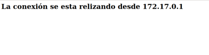

# Documentación del Proyecto

## 1. Creación de una aplicación Flask para mostrar la IP de conexión (Puerto 8000)

1.1. Se instala Flask para el desarrollo de la aplicación.

1.2. Se accede a la carpeta de trabajo para editar el archivo `sample_app.py`.

1.3. Se crea el script principal en `sample_app.py` utilizando el editor nano.

1.4. Se ejecuta el script y se verifica el resultado, comprobando que la aplicación muestra correctamente la IP de conexión.

---

## 2. Implementación de una interfaz web con HTML y CSS (Puerto 8181)

2.1. Se modifica el código anterior para incorporar una plantilla HTML y estilos CSS, mejorando la presentación de la IP de conexión.

2.2. Se ejecuta la nueva versión y se verifica que la interfaz web muestra correctamente la IP de conexión en el puerto 8181.

---

## 3. Despliegue en Docker mediante un script Bash (Puerto 8888)

3.1. Se crea el script `sample_app.sh`, encargado de construir y ejecutar el contenedor Docker.

3.2. Se verifica la versión instalada de Docker para asegurar la compatibilidad.

3.3. Se agregan las librerías necesarias en la configuración del proyecto.

3.4. Se edita el archivo `Dockerfile` para definir la imagen del contenedor.

3.5. Se mueve el `Dockerfile` a la carpeta `tempdir` y se revisa su contenido.

3.6. Se construye la imagen de Docker utilizando el comando `docker build -t rcristian .`.

3.7. Se comprueba que la imagen se haya creado correctamente.

3.8. Se verifica el estado de la configuración y los contenedores en ejecución.

3.9. Finalmente, se comprueba que la conexión al sitio web funciona correctamente desde el contenedor expuesto en el puerto 8888.

