1.- se crea una aplicación flask debe mostrar la ip desde donde está conectado y debe correr en el puerto 8000
1.1.- Se Instala Flask

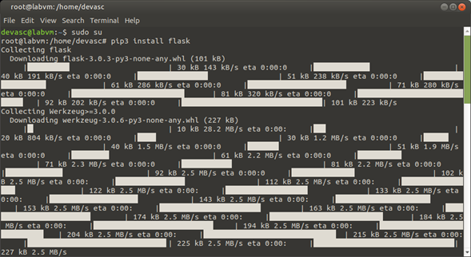

1.2.- Se llega hasta la carpeta deseada para poder editar el sample_app.py

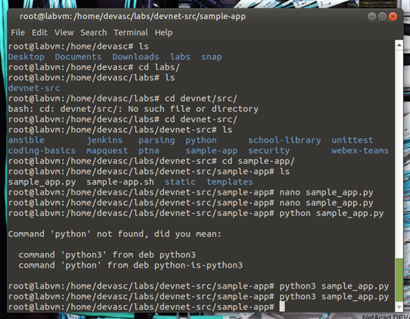

1.3.- script que se pondrá en el nano

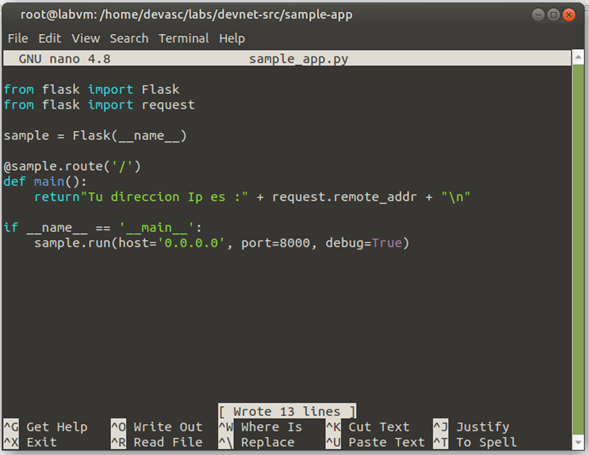

1.4.- resultado del script 

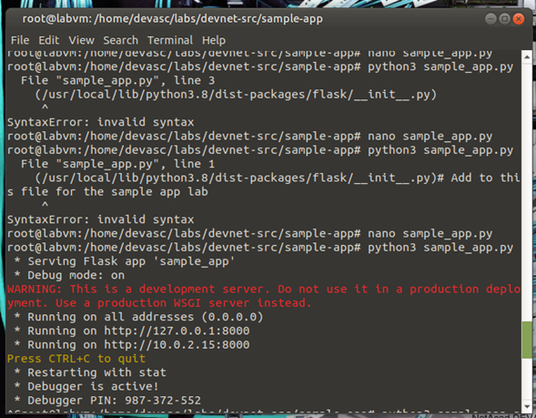
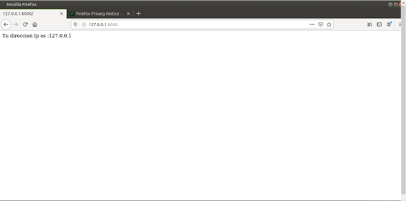
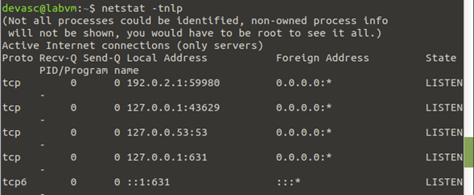

---------------------------------------------------------------

2.- levantamos una aplicación Python, y usando plantilla html y css, que levante un sitio web que verifique la ip de conexión y que corra en el puerto 8181
2.1.- cambiamos algunas cosas del codigo anterior

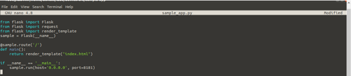

2.2.- el resultado que deberíamos tener es

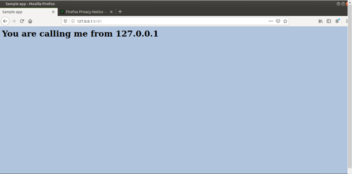
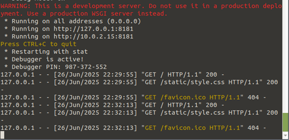
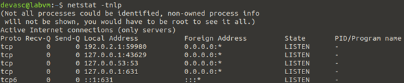

---------------------------------------------------------------

3.- se creará un script en bash que cree y corra un contenedor Docker a partir de un archivo Dockerfile, que levante un sitio web y que exponga el puerto 8888. Compruebe conexión y que el contenedor está corriendo

3.1.- en sample_app.sh se crea este script

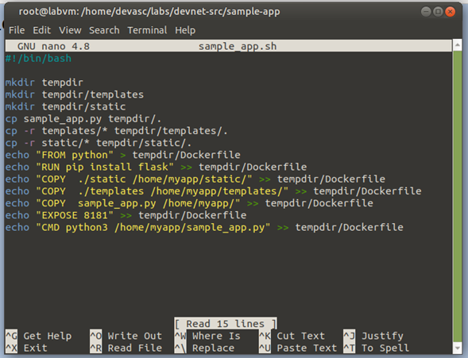

3.2.- luego se verifica la version de Docker

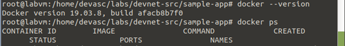

3.3.- se agregan las librerías antes vistas en la config de sample

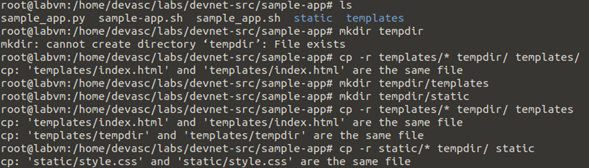

3.4.-  se modifica el nano Dockerfile

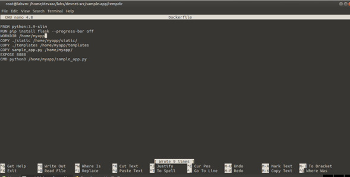

3.5.- se mueve el dockfile a la carpeta de tempdir y se revisa contenido

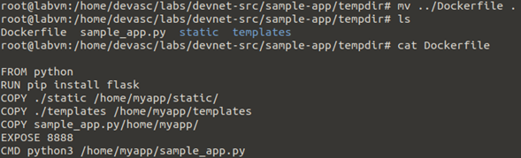

3.6.- se instala el contenido del Docker usando Docker build -t rcristian .

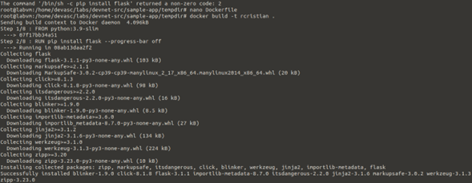
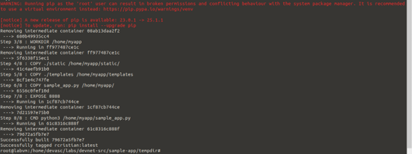

3.7.- se comprueba lo instalado

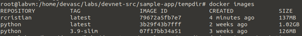

3.8.- se verifica los estatus de la config

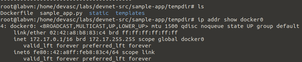
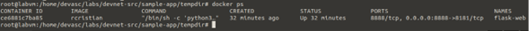

3.9.- se verifica que funciono la conexión

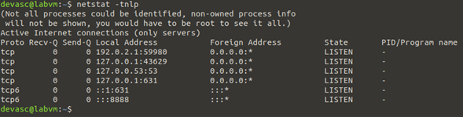

