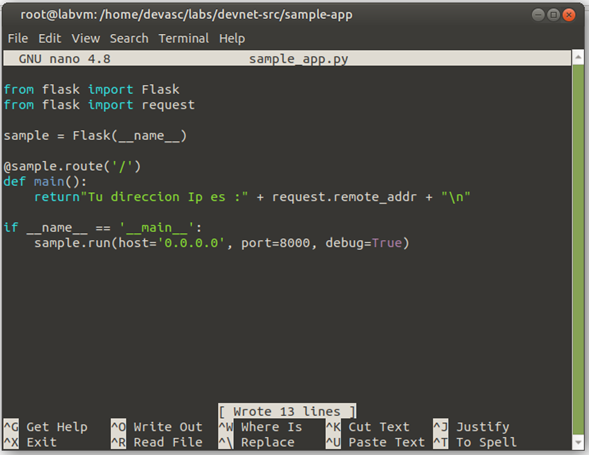
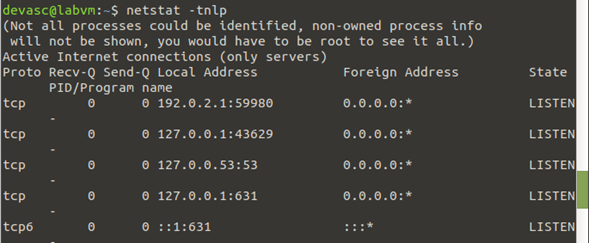

1.- se crea una aplicación flask debe mostrar la ip desde donde está conectado y debe correr en el puerto 8000
1.1.- Se Instala Flask

---------------------------------------------------------------

1.2.- Se llega hasta la carpeta deseada para poder editar el sample_app.py

1.3.- script que se pondrá en el nano

1.4.- resultado del script 

2.- levantamos una aplicación Python, y usando plantilla html y css, que levante un sitio web que verifique la ip de conexión y que corra en el puerto 8181
2.1.- cambiamos algunas cosas del codigo anterior

